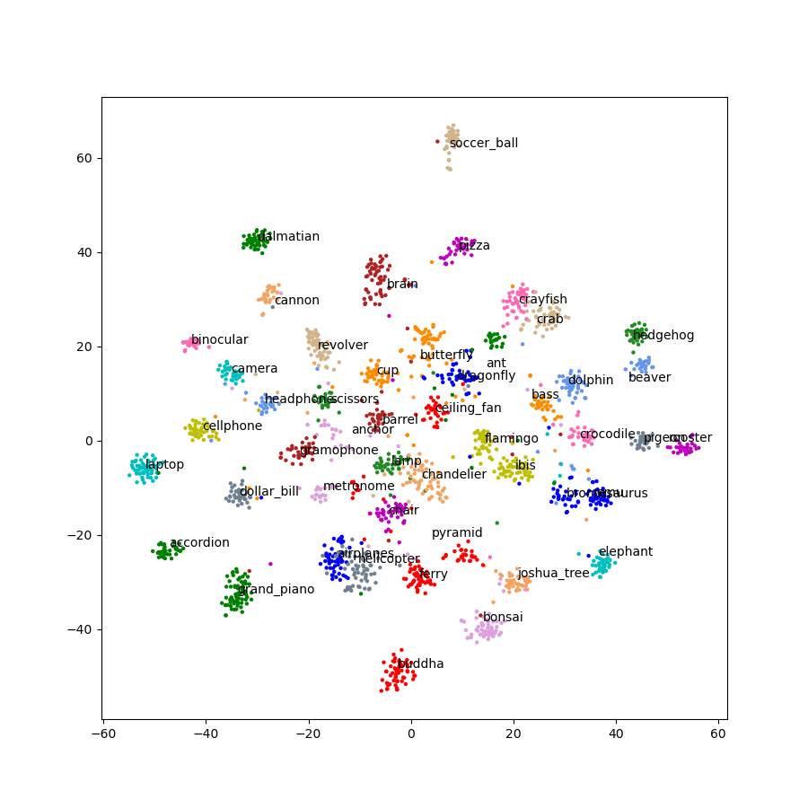
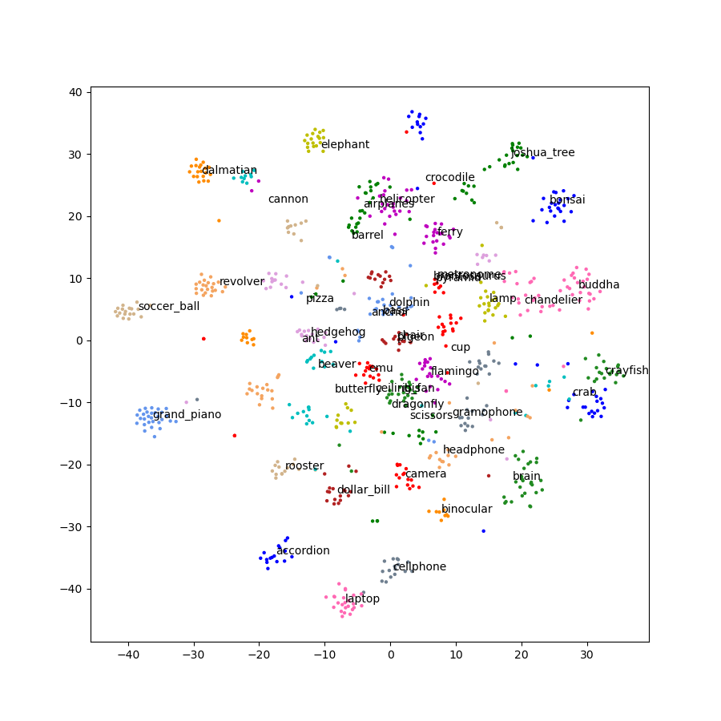
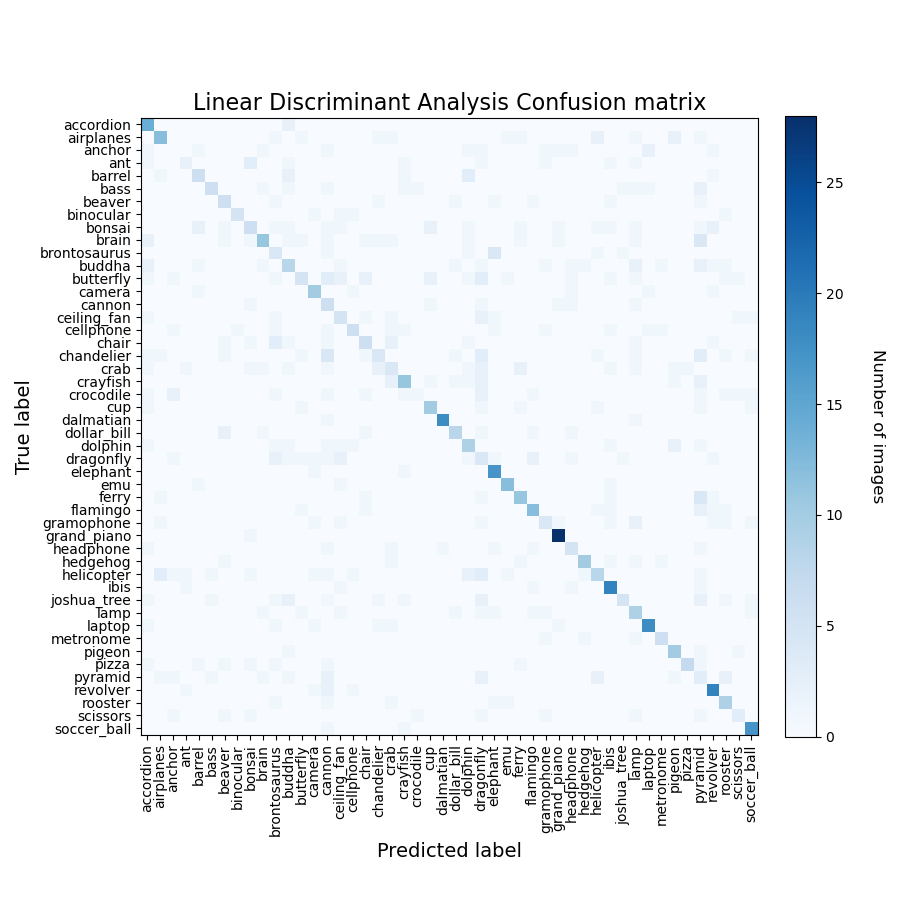

# RNN-ML-classify

## 介绍

使用TensorFlow预训练好的RNN模型来提取预分类特征，进而使用预分类特征在机器学习上进行训练和分类。

## 项目来源

#### 项目借鉴于github上的([地址](https://github.com/snatch59/cnn-svm-classifier))

1. 此示例使用来自 Caltech 图像的 48 个标记图像的子集设置(http://www.vision.caltech.edu/Image_Datasets/Caltech101/)，每个标签限制在 40 到 80
   张图像之间。图像被馈送到带有分类层的 Inception V3 的 TensorFlow 实现删除最后一层分类用的dense层。
2. 使用 2048-d 特征进行降维 `t-distributed stochastic neighbor embedding` (t-SNE) t-分布随机邻域嵌入来转换它们成易于可视化的二维特征。请注意，使用 **t-SNE**
   作为一个提供信息的步骤。如果相同的颜色/标签点大多是聚集在一起，我们很有可能可以使用这些功能训练一个高精度的分类器。
3. 将 2048-d 标记的特征呈现给许多分类器。 最初，该项目是训练支持向量机 分类图像，但是为了比较，这已扩展到下列的：

* Support Vector Machine (SVM, LinearSVC)
* Extra Trees (ET)
* Random Forest (RF)
* K-Nearest Neighbor (KNN)
* Multi-Layer Perceptron (ML)
* Gaussian Naive Bayes (GNB)
* Linear Discriminant Analysis (LDA)
* Quadratic Discriminant Analysis (QDA)

## 安装教程

需要安装 [TensorFlow2-gpu](https://www.tensorflow.org/install) 和 sklearn，最好使用GPU。 电脑显卡型号：NVIDIA GeForce
GTX1650，整个`inception_v3_svm_train.py`文件运行时间233.41s，整个`inception_v3_svm_test.py`文件运行时间61.64s。

## 使用说明

1. 下载完代码后，首先直接在此目录下解压`caltech_101_images.zip`，然后将图像放入`./caltech_101_images/train`文件夹中，同时和train同一级目录创建test目录。
* 最终文件结构：
* |
* |-- caltech_101_images
* |   |-- train **解压放置的目录**
* |   |-- test
2. 可以直接使用`datasetSegmentation.py`脚本进行数据分割，脚本默认是30%测试数据，脚本会将分割好的测试数据集从`train`目录搬运到`test`目录中。
3. 之后可以使用`inception_v3_svm_train.py`脚本进行训练，脚本会将训练好的模型放到`model`目录中，同时在训练中也会进行test的测试，这个测试是和`inception_v3_svm_test.py`
   这个脚本测试结果相同，`inception_v3_svm_test.py`这个脚本测试是需要`inception_v3_svm_train.py`训练完的模型。

## 训练和测试的结果如下：

#### 训练集图片数量： 2071；测试集图片数量：860.

### Inception V3 模型

| 模型                              | 时间     | 正确率   |
|---------------------------------|--------|-------|
| LinearSVC                       | 4.84s  | 96.4% |
| SVC                             | 19.94s | 90.2% |
| Extra Tree                      | 0.74s  | 91.5% |
| Random Forest                   | 7.67s  | 90.0  |
| K-Nearest Neighbours            | 2.61s  | 92.7% |
| Multi-layer Perceptron          | 10.32s | 95.8% |
| Gaussian Naive Bayes            | 1.08s  | 90.0% |
| Linear Discriminant             | 4.43s  | 48.7% |
| Quadratic Discriminant Analysis | 1.07s  | 3.4%  |

## t-SNE train features

## t-SNE test features

## Linear SVC

## SVC

## Extra Tree

## Random Forest

## K-Nearest Neighbours

## Multi-layer Perceptron

## Gaussian Naive Bayes

## Linear Discriminant Analysis

## Quadratic Discriminant Analysis

